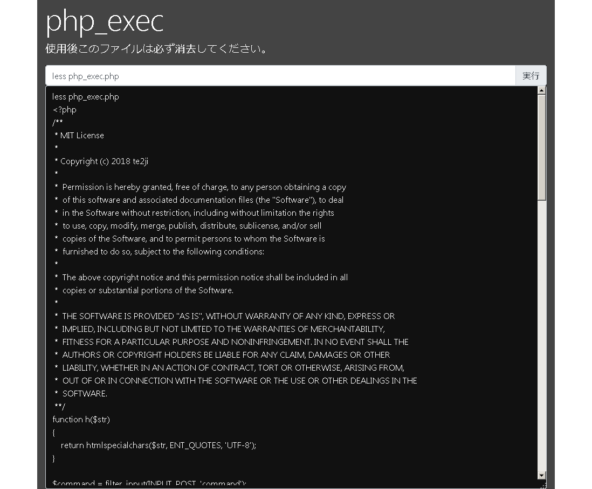

# php_exec

レンタルサーバで、サーバの設定を確認したかったり、FTP ツールでは出来ないことを実施したいとき、簡易的にコマンドラインを提供するスクリプトです。
`php_exec.php` だけをサーバの公開領域に設置すれば使用できます。
**ただし、php の exec コマンドが使えないサーバでは使用できません。**

## 使用方法

php_exec.php をサーバにアップロードし、ブラウザからアクセスしてください。
以下のような画面が表示され、コマンドを実行することで、その結果を確認できます。
コマンドを ajax で投げ、結果を受けて表示しているだけなので、vi を使用した編集等は出来ません。

## スクリーンショット

